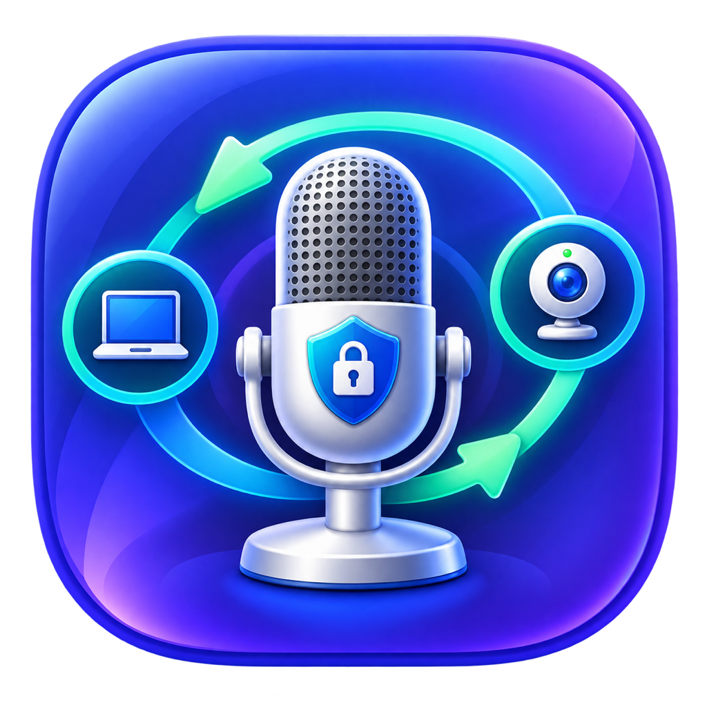

<p align="center">
  
</p>

<h1 align="center">Mic Input Guardian</h1>

<p align="center">
  A small, native macOS menu bar utility that keeps your preferred microphone selected.
</p>

Mic Input Guardian watches CoreAudio device changes and applies the policy you configure. It works with built-in, USB, Bluetooth, virtual, camera, dock, and display audio devices without vendor-specific rules or external command-line dependencies.

## Features

- Lists all currently available input devices in the menu bar.
- Switches the system default microphone directly through CoreAudio.
- Remembers devices by stable CoreAudio UID instead of display name.
- Reapplies the selected policy when audio hardware changes.
- Provides a configurable **output-triggered rule**: when one chosen output appears, select a chosen microphone.
- Can keep one microphone selected regardless of output changes.
- Includes a **System managed** mode that observes without changing anything.
- Lets you pause automatic fixing without losing your configuration.
- Runs as a menu-bar-only accessory app with no Dock icon.
- Does not capture or transmit audio.

## Requirements

- macOS 13 Ventura or later
- Xcode 15 or later, or matching Xcode Command Line Tools

## Configure a rule

1. Open the microphone icon in the menu bar.
2. Choose **Settings…**.
3. Set **Policy** to **Output-triggered rule**.
4. Choose the output device that should activate the rule.
5. Choose the microphone that should become the system default.

When the trigger output is not connected, the app leaves the current system default unchanged. Device choices are saved and restored on the next launch.

Selecting a microphone directly from the menu switches to **Keep selected input** automatically.

## Build from source

```bash
git clone https://github.com/yinon-mitin/MicInputGuardian.git
cd MicInputGuardian
./script/build_and_run.sh
```

The script builds the Swift package, stages a locally ad-hoc-signed app at `dist/MicInputGuardian.app`, and launches it.

Build a release bundle without launching it:

```bash
./script/build_and_run.sh --release
```

Run tests:

```bash
swift test
```

Regenerate `AppIcon.icns` from the checked-in 1024 px source icon:

```bash
./script/generate_icon.sh
```

## Install

1. Run `./script/build_and_run.sh --release`.
2. Copy `dist/MicInputGuardian.app` to `/Applications`.
3. Open the copied app once.
4. Optional: add it in **System Settings → General → Login Items**.

Local builds are ad-hoc signed, not Developer ID signed or notarized. Public binary releases should be signed and notarized with an Apple Developer account.

## How it works

The app listens for changes to the CoreAudio system device list and default input/output properties. A short debounce prevents repeated work while macOS publishes a cluster of hardware events. The controller evaluates the saved policy and only calls `AudioObjectSetPropertyData` when the desired device differs from the current default.

No microphone-recording permission is required because the app changes a system preference but never opens or records an audio stream.

## Project structure

```text
Sources/MicInputGuardian/
├── App/        Application and scene lifecycle
├── Models/     Audio devices and policy evaluation
├── Services/   CoreAudio access
├── Stores/     Persistent state and device monitoring
└── Views/      Menu bar and Settings UI
```

The project uses Swift Package Manager and has no third-party dependencies.

## Contributing

See [CONTRIBUTING.md](CONTRIBUTING.md). Bug reports and focused pull requests are welcome.

## License

Released under the [MIT License](LICENSE).
